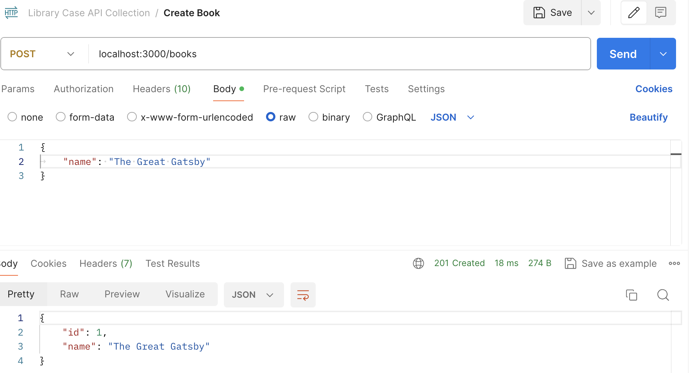

# Library Management System
Library Management app using Node.js, Express.js, TypeScript, and MySQL.

## Requirements:
There should be **mysql** service installed on the system. MySQL user name and password can be set on the src/database.ts file.

## How to Run:
```console
npm install
npm run build
npm start
```

## Screenshots:
<kbd></kbd>    <kbd></kbd>    <kbd></kbd>    <kbd></kbd>     <kbd></kbd>    <kbd></kbd>    <kbd></kbd>    <kbd></kbd>    <kbd></kbd>
